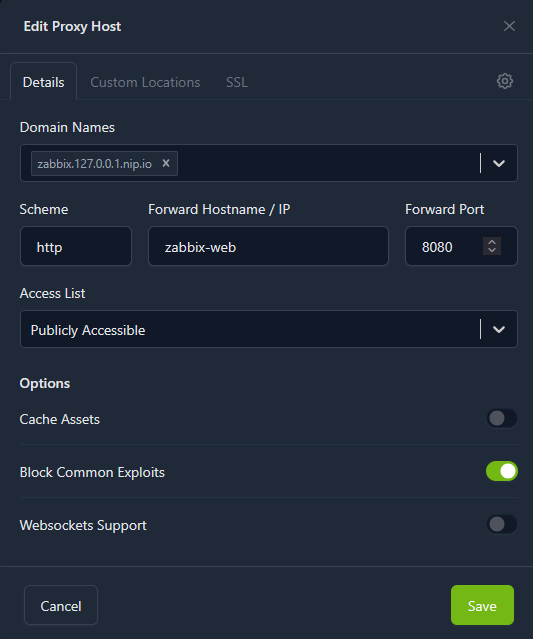

# A Zabbix in docker

## Run server with dashboard and DB

I have containerized the Zabbix server using the `docker-compose.yaml` file. Before running it, create a `.env` file and complete it with values (you can find an example in the repo).

Of course, you will need Docker and Docker Compose installed on your host machine to run this file.

To run in detached mode, use the command below:

bashAfter that, you should be able to visit the Zabbix dashboard.

### **Important**

If you plan to host dashboard into external net - please delete the `/setup.php` file from the server to prevent cyberattact.

## Added Nginx Proxy

To adapt this setup for cloud environments (EC2/VPS), I added [Nginx Proxy Manager](https://nginxproxymanager.com/). It acts as a reverse proxy with a GUI and automatic SSL/Certbot support.

### **Key Ports**

* **81** - Proxy Manager Admin Panel (restrict access or tunnel via SSH for security).
* **80 / 443** - Standard HTTP/HTTPS traffic.
* **8080** - Zabbix Dashboard (internal only, proxied via Nginx).
* **10051** - Zabbix Server listener (for external agents communication).

