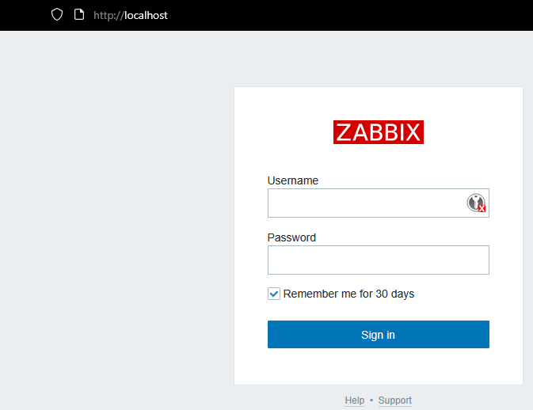

# A Zabbix in docker

## Run server with ashboard and DB

I have containerized the Zabbix server using the `docker-compose.yaml` file. Before running it, create a `.env` file and complete it with values (you can find an example in the repo).

Of course, you will need Docker and Docker Compose installed on your host machine to run this file.

To run in detached mode, use the command below:

bashAfter that, you should be able to visit the Zabbix dashboard.

btw. if you use this repo to a training (as it was intended) - disbale a deafult host (bcs it was instaled via docker and I want to prevent a `privileged` flag)

### **Important**

If you plan to host dashboard into external net - please delete the `/setup.php` file from the server to prevent cyberattact.
